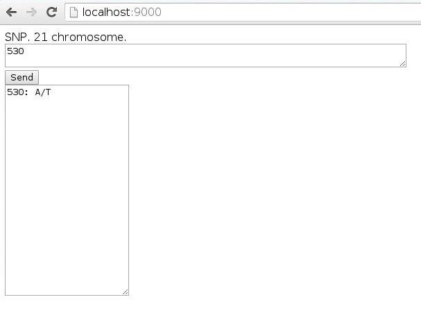

# SNPServer

It was a project for creating server with one complete database of all known single nucleotide polymorphisms. 

## Idea

* take .xml from open resource with collection of SNPs.
* parse this .xml and create my own database 
* create server that can accept requests to this database and send back JSON with all information about requested SNPs.

## Ways to improve

* optimize .xml parsing, now it takes too long
* optimize database search

## Demo with simple interface, server on localhost and just basic information about SNP.
 
